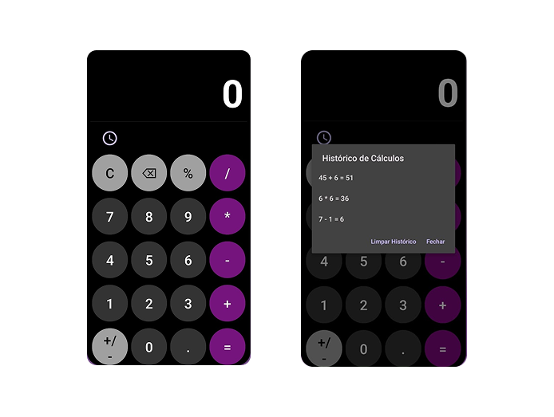

 🌐 <b>Languages:</b> <a href="./README.md">English 🇺🇸</a> • <b>Português 🇧🇷</b> 

🧮 Aplicativo de Calculadora

Aplicativo mobile desenvolvido utilizando Java e XML para realizar cálculos matemáticos de forma rápida e eficiente.
O app oferece uma interface simples e intuitiva, permitindo que os usuários realizem cálculos do dia a dia com facilidade.

 
🚀 Funcionalidades

- Operações básicas (adição, subtração, multiplicação e divisão)
- Exibição de cálculos em tempo real
- Interface limpa e intuitiva

 
🛠 Tecnologias

- Java
- XML (Layouts Android)
- Android Studio

 
💡 Usabilidade

A aplicação foi projetada com foco em simplicidade e facilidade de uso.
Os usuários podem realizar cálculos rapidamente através de uma interface intuitiva, tornando o app prático para o uso diário.

 
📸 Interface da Aplicação
 

  

 
▶ Como Executar o Projeto

- Clone o repositório
- Abra o projeto no Android Studio
- Sincronize as dependências do Gradle
- Execute o aplicativo em um emulador ou dispositivo físico
